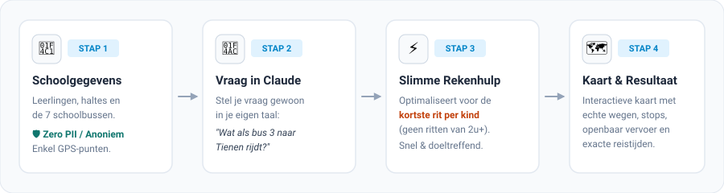
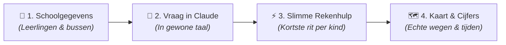
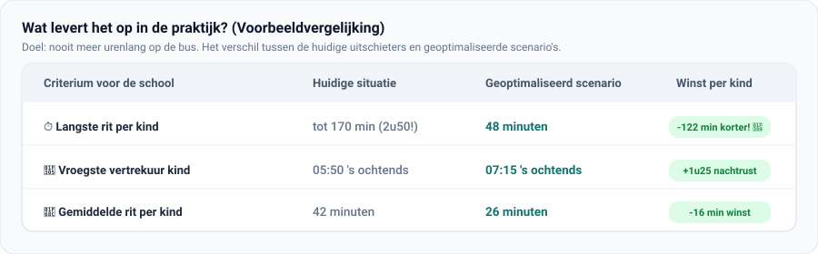

# 🚌 Schoolbus Routeplanner · "de pass" Hoegaarden

> **AI-gestuurde routeplanning voor de 7 schoolbussen van buitengewoon onderwijs "de pass" in Hoegaarden. Niet gericht op de laagste vlootkost, maar op wat écht telt: een zo kort mogelijke rit per kind.**

---

## 🎯 Waarom deze tool?

De school **"de pass"** in Hoegaarden brengt dagelijks zo'n 140 leerlingen met 7 bussen naar school en weer thuis. 

Klassieke navigatiesoftware berekent routes meestal voor transportbedrijven: zo min mogelijk diesel voor de bus, ook al zit een kind daardoor ruim een uur nodeloos rond te rijden. **Deze tool draait de prioriteit om:**

- 🧒 **Het kind staat centraal:** we zoeken altijd naar routes die de individuele reistijd minimaliseren.
- ⚡ **Direct scenario's vergelijken:** binnen enkele seconden zie je het effect van een wijziging (bijvoorbeeld een regiobus of een vaste opstapplaats).
- 💬 **Geen programmeerkennis nodig:** je praat gewoon in het Nederlands met Claude.

---

## ✨ Wat kan je met deze tool?

In plaats van handmatig puzzelen met spreadsheets of dure adviesbureaus in te schakelen, stel je direct vragen aan Claude:

* 📍 **Regiobussen uittesten:** *"Wat gebeurt er als bus 3 alle leerlingen rond Tienen ophaalt via een snelle verbinding?"*
* 🚏 **Vaste opstapplaatsen simuleren:** *"Wat als we in Leuven een centrale opstapplaats gebruiken aan het station in plaats van deur-aan-deur?"*
* 🔄 **Bussen herverdelen:** *"Verdeel de leerlingen opnieuw over bus 1 en 2 zodat niemand langer dan 45 minuten op de bus zit."*
* 🗺️ **Interactieve kaarten bekijken:** bekijk de echte wegen, haltes en zelfs aansluitingen met bussen van De Lijn of treinen van de NMBS.

---

## 🚀 Hoe het werkt

De routeplanner volgt een heldere, betrouwbare flow:

1. **Schoolgegevens (éénmalig):** De school bewaart lokaal een lijst met de 7 bussen, halteplaatsen en gewenste aankomsttijden.
2. **Vraag stellen:** Je typt in Claude wat je wilt onderzoeken.
3. **Slimme berekening:** De plugin berekent razendsnel verschillende combinaties om de ritten zo kort mogelijk te maken.
4. **Visuele kaart:** Claude toont direct een vergelijkingstabel én een interactieve kaart met de echte straten en haltes.

---

## 💡 Wat doet deze plugin onder de motorkap?

Voor wie benieuwd is wat de code achter de schermen doet:

> **De plugin fungeert als het gespecialiseerde routebrein voor Claude.**
>
> 1. **Matrix-rekenkracht:** De code berekent en bewaart de afstanden tussen alle mogelijke haltes. 
> 2. **Wiskundige optimalisatie:** Zodra je een vraag stelt, doorzoekt het algoritme razendsnel tienduizenden combinaties om de optimale volgorde van stops te vinden waarbij geen enkel kind te lang onderweg is.
> 3. **Echte wegendata via TomTom:** Pas wanneer een scenario op punt staat, haalt de plugin éénmalig de exacte bochten, straten en keertijden op via TomTom.
> 4. **Kaartgenerator:** Tot slot genereert de code een complete, interactieve routekaart (`map.html`) die je direct in Claude of in je browser kunt bekijken.

---

## 📊 Wat levert het op? (Voorbeeld)

Door een slimme herverdeling of het toevoegen van strategische opstapplaatsen worden ritten merkbaar korter en aangenamer:

| Criterium | Huidige situatie | Met geoptimaliseerd scenario | Winst per kind |
|:---|:---:|:---:|:---:|
| ⏱️ **Langste rit per kind** | 72 min | **48 min** | **-24 min korter** 🎉 |
| 🚌 **Gemiddelde rit per kind** | 39 min | **26 min** | **-13 min winst** |
| 📍 **Vroegste vertrekuur** | 06:45 | **07:15** | **Halfuur langer slapen** |
| 🛣️ **Totale kilometers vloot** | 295 km | **248 km** | **-47 km minder uitstoot** |

---

## 💻 Installeren in Claude Desktop

Deze tool is direct beschikbaar als een **Claude Plugin** (`.plugin`). Je hoeft niets te programmeren of te compileren.

### Stappenplan:
1. **Download de plugin:**  
   Download het bestand `de-pass-routeplanning.plugin` van de [meest recente release](https://github.com/markminnoye/de-pass-routeplanning/releases/latest).
2. **Open Claude Desktop:**  
   Open de Claude Desktop-applicatie op je computer.
3. **Plugin toevoegen:**  
   Ga naar het menu **Settings** (Instellingen) ➔ **Plugins** (of kies *Add Plugin*). Selecteer het gedownloade `.plugin`-bestand.
4. **Koppel je datamap:**  
   Plaats de gegevensmap van de school (met leerlingcoördinaten en buscapaciteiten) in een lokale werkmap op je computer en verwijs ernaar in Claude.
5. **Klaar voor gebruik!**  
   Open een nieuw gesprek en begin direct met vragen stellen.

---

## 💬 Voorbeeldvragen voor Claude

Zodra de plugin actief is, kan je Claude vragen:

* *"Reken de huidige situatie door en geef me de 3 langste ritten."*
* *"Wat als we een centrale opstapplaats voorzien aan het station van Tienen voor bus 3?"*
* *"Zoek een betere volgorde voor bus 6 zodat de reistijd daalt."*
* *"Toon me de interactieve kaart met alle haltes van scenario 2."*
* *"Vergelijk het huidige scenario met het voorstel voor regiobussen in een tabel."*

---

## 🔒 Privacy & Veiligheid

Thuisadressen en namen van minderjarige leerlingen zijn uiterst gevoelige gegevens:

* 🛡️ **Geen persoonsgegevens op het internet:** Namen en exacte adressen komen **nooit** in de plugin en **nooit** op GitHub terecht.
* 📍 **Alleen anonieme punten:** Berekeningen gebeuren uitsluitend met anonieme haltecoördinaten (bv. een straathoek of bushalte).
* 🏠 **Data blijft bij de school:** De echte leerlingendossiers blijven altijd veilig bewaard binnen de eigen vertrouwde schoolomgeving.
