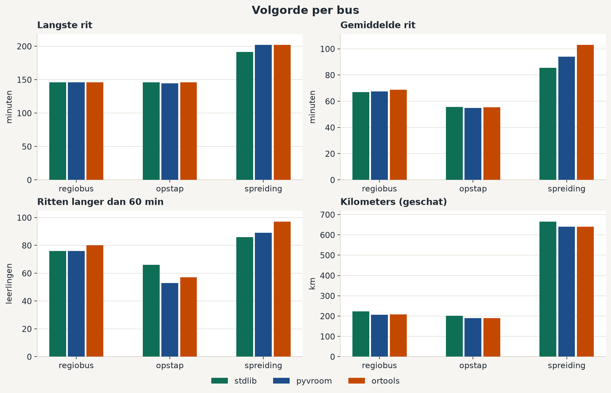
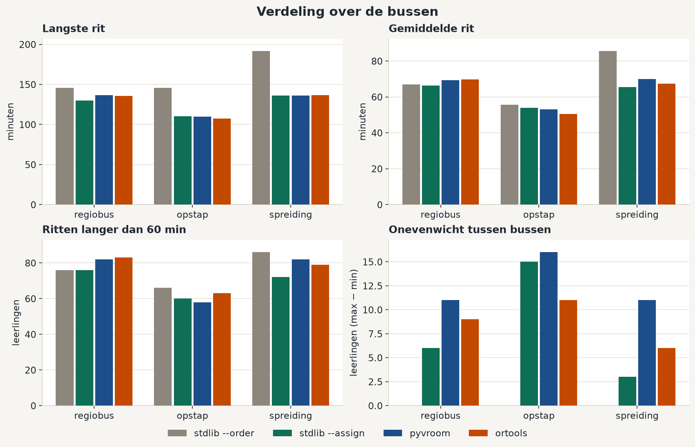
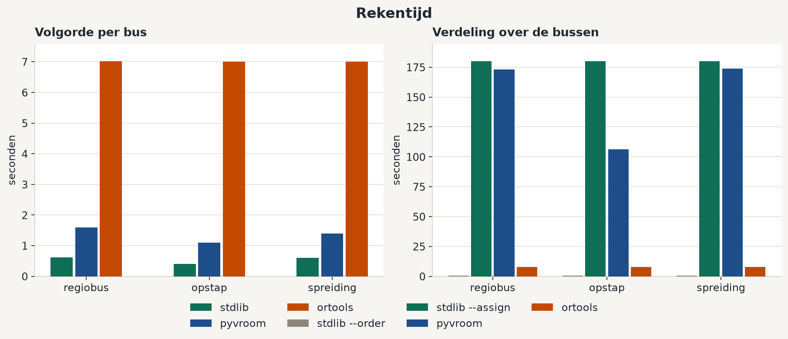

# Solver-benchmark (23/09/2026)

Vergelijking van de stdlib-solver, pyvroom en OR-Tools op **één matrix**, voor twee vragen: de stopvolgorde per bus (`optimize --order`) en de verdeling van leerlingen over de bussen (`optimize --assign`). Score is `evaluate --offline`.

De cijfers hier zijn een schatting op een gladgemaakte matrix, geen TomTom-`evaluate` op een verkeersdag. De tabel van 22/09 in [data-en-tooling-opties.md](data-en-tooling-opties.md) blijft de volgorde-vergelijking op de echte per-bus-cellen. De minuten uit de twee tabellen mag je niet naast elkaar leggen.

## Inputparameters

De tabellen en de drie grafieken komen uit **één** run. Hieronder staat alles wat die run vastlegde. Een herhaling met hetzelfde commando op dezelfde bestanden gebruikt dezelfde invoer. OR-Tools en de afgekapte stdlib-verdeling stoppen op de klok, dus de halte kan op een andere machine een stap verschuiven.

### Dataset en matrix

| | |
|---|---|
| Pakket | `docs/samples/` (default van de evaluator; geen `data/`, geen `BUSROUTES_DATA_DIR`) |
| Gegenereerd door | `scripts/generate_testset.py`, seed `20260914`. De benchmark leest de JSON die al in de repo staat en genereert niets opnieuw |
| School | één: `docs/samples/school.json`, "de pass (Hoegaarden)", `50.778160, 4.896000`, gewenste aankomst `08:30` |
| Leerlingen | 140, `docs/samples/students.json`, elk een eigen coördinaat. Zones: hoegaarden-centrum 30, tienen 24, leuven 14, meldert 10, boutersem 10, landen 10, outgaarden 8, hoksem 6, jodoigne 6, kumtich 6, bierbeek 6, linter 6, zoutleeuw 4 |
| Bussen | 7, `docs/samples/buses.json`: `bus1`–`bus7`, capaciteit **30** elk, start = de school |
| Opstapplaatsen | `docs/samples/pickup_points.json`: Tienen station, Tienen Grote Markt, Leuven station. Alleen `opstapplaatsen` gebruikt ze |
| Referentiedatum | `2026-09-15` (dinsdag), vast in `scripts/bench_full.py`. Offline negeert het vertrekuur: de ritduren hangen niet van die datum af |
| Echte cellen | `docs/samples/matrix/`, 4.956 paren met reistijd > 0 en afstand ≥ 1 m. TomTom Matrix Routing v2, `departAt=any`, `traffic=historical`, `travelMode=car`, `routeType=fastest`. Alleen de paren binnen elke referentiebus |
| Ontbrekend | de paren tussen bussen. Die zijn niet geschat naast de echte cel, want dan zou een overstap een ander soort getal zijn dan een rit binnen de bus |

Elk paar in de benchmark, ook een paar waarvoor een TomTom-cel bestaat, komt uit één kleinste-kwadratenlijn door die 4.956 cellen (`scripts/bench_matrix.py`):

`seconden = max(1, afgerond(277,7976 + 0,075533 × meter))`

Dat is 278 seconden plus 75,5 seconden per kilometer. R² = 0,868. Mediane absolute fout 18,3%. Mediane snelheid in de cellen 6,87 m/s (25 km/u); de helling zelf is ongeveer 48 km/u bovenop die vaste 278 seconden. De lijn is symmetrisch. De diagonaal is 0. Eenrichtingsverkeer en het verschil tussen heen en terug zitten er niet in.

Kilometers in de tabellen zijn niet die lijn. `evaluate --offline` zet elke leg op hemelsbreed × 1,3 (`km_estimated: true`).

### Scenario's

Bestanden in `docs/samples/scenarios/`. Elk scenario wijst alle 140 leerlingen toe, niemand dubbel, niemand vastgezet (`pinned` en `pinned_stops` ontbreken). Invoer heeft `"ordering": "auto"`. Na een solver zet de benchmark de volgorde op `given`, zodat `evaluate` niet nog een keer herordent.

Startbezetting is overal 20 leerlingen per bus (140 / 7). Onevenwicht bij de start is dus 0. Capaciteit 30 wordt nergens geraakt.

| Scenario | Bestand | Startregel | Stops |
|---|---|---|---|
| `regiobus-per-zone` | `docs/samples/scenarios/regiobus-per-zone.json` | Eén streek per bus, ophalen aan huis. bus1: 20× hoegaarden-centrum. bus2: 10× hoegaarden-centrum + meldert. bus3: outgaarden + hoksem + jodoigne. bus4: 20× tienen. bus5: 4× tienen + kumtich + boutersem. bus6: bierbeek + leuven. bus7: landen + linter + zoutleeuw | 140 (één stop per leerling) |
| `opstapplaatsen` | `docs/samples/scenarios/opstapplaatsen.json` | Dezelfde streken. bus4 haalt 10 leerlingen op aan Tienen station en 10 aan de Grote Markt. bus6 haalt bierbeek aan huis en de 14 Leuven-leerlingen aan het station. De rest blijft aan huis | 109 |
| `spreiding-gemengd` | `docs/samples/scenarios/spreiding-gemengd.json` | Negatieve referentie. `random.Random(20260915)` schudt de 140 id's; daarna round-robin over de zeven bussen. Zones door elkaar, ophalen aan huis | 140 |

### Solverknoppen van de gepubliceerde tabellen

Commando, vanaf de repo-wortel, zonder extra vlaggen:

```bash
uv sync --group bench
uv run python scripts/bench_full.py
```

Dat schrijft `docs/images/solver-bench-order.png`, `solver-bench-assign.png`, `solver-bench-runtime.png` en `out/bench/full.json`. De JSON bevestigt de knoppen hieronder. Een kortere proef met `--stdlib-seconds` of `--scenarios` is een andere run en hoort niet bij deze tabellen.

Stilstand, voor elke solver en voor de score: **30 s + 10 s per leerling op die stop** (`BUSROUTES_DWELL_*` stond niet gezet). Een huisstop is 40 s. Tienen station (10 leerlingen) is 130 s. De rit van een kind loopt van het vertrek aan zijn stop tot aankomst op school en telt de eigen stilstand niet mee.

| Knop | Waarde in deze run |
|---|---|
| Seed | **0**, alleen voor `optimize_assign`. Geen tweede seed, geen sweep |
| stdlib `--order` | `order_stops_for_bus`: 2-opt en or-opt tot een lokaal optimum. Geen tijdslimiet, geen seed. Doel `(langste rit, som van de ritten, totale rijtijd)` |
| stdlib `--assign` | `max_seconds=180`, `max_perturbations=200`, seed 0. Eerst `--order`, dan relocate/swap. De perturbatielus (ook een stall-limiet van 200) start pas daarna |
| Wat `--assign` deed | Op **alle drie** de scenario's: `perturbaties=0`, `gestopt door max_seconds`. De eerste lokale zoektocht was na 180 s nog bezig. Het perturbatieplafond is niet gehaald. Dit is niet de CLI-default (die is 30 s en 1.000 perturbaties) |
| pyvroom | 1.15.2. `exploration_level=5`, `nb_threads=1`, geen timeout. Duurmatrix, profiel `car`. Eerst onbeperkt, dan binaire zoektocht naar de laagste `max_travel_time` die nog elke stop inplant. Volgorde: één voertuig per bus, depot = school. Verdeling: zeven voertuigen, `capacity=[30]`, job `pickup=[aantal leerlingen]`, stilstand = `default_service` |
| OR-Tools volgorde | 9.15.6755. Eén voertuig per bus, 1 s per bus. Eerste oplossing `PATH_CHEAPEST_ARC`, daarna `GUIDED_LOCAL_SEARCH`. Boog = reistijd + stilstand aan de oorsprong. Tijd-dimensie, `GlobalSpanCost` 100 |
| OR-Tools verdeling | 8 s voor het hele scenario. Eerste oplossing `PARALLEL_CHEAPEST_INSERTION`, daarna `GUIDED_LOCAL_SEARCH`. Zelfde boog en `GlobalSpanCost` 100. Vaste kost per bus 0. Capaciteit hard, vraag = leerlingen op de stop. `log_search` uit. Deze build heeft geen knop voor één zoekthread |

`stdlib --order` in de verdeeltabel is dezelfde run als de stdlib-rij bij volgorde, geen tweede zoektocht.

### Score

Alles gaat door `evaluate` op de `SpeedMatrixClient` (`mode: offline`).

| Kolom | Definitie |
|---|---|
| max rit (min) | langste rit over de 140 leerlingen, in minuten, afgerond op 0,1 |
| gem. rit (min) | gemiddelde van die 140 ritten, niet het gemiddelde per stop |
| ritten > 60 | aantal leerlingen met rit > 3.600 s |
| km | som van de legs, hemelsbreed × 1,3, afgerond op 0,1 km |
| onevenwicht | leerlingen op de volste bus min leerlingen op de leegste, over alle zeven bussen, lege bus telt als 0 |
| rekentijd (s) | alleen de zoektocht, niet het inlezen van de matrix en niet `evaluate` |

### Omgeving

| | |
|---|---|
| Machine | M3arkBookPro, macOS 26.7, arm64 |
| Python | 3.13.15, via uv 0.12.15 |
| pyvroom | 1.15.2 (10,2 MiB), plus numpy 2.5.3 en pandas 3.0.6 |
| OR-Tools | 9.15.6755 (65,5 MiB) |
| matplotlib | 3.11.2, alleen voor de PNG's |
| Plugin | `project.dependencies` is leeg. Deze pakketten zitten in de groep `bench` |

### Wat niet gevarieerd is

- Eén seed (0). Geen herhaling met een andere seed.
- Eén tijdslimiet per solver, de waarden in de tabel hierboven. Geen sweep.
- Stilstand, capaciteit, school, leerlingen en de drie scenariobestanden zijn niet gevarieerd.
- Geen TomTom-`evaluate` zonder `--offline`. De ontbrekende paren zijn niet aangekocht.
- Geen publieke VROOM-demo (`solver.vroom-project.org` gebruikt OSRM, niet deze matrix).
- Geen Google Route Optimization (geen GCP-project; dat objectief is vlootkost).
- De volgorde-tabel van 22/09 op de echte per-bus-cellen is een andere matrix. Die minuten horen niet in deze tabellen.

## Advies

**De plugin houdt de stdlib-solver.** pyvroom en OR-Tools blijven in de dependency-groep `bench`. VROOM hosten is niet nodig.

Het doel is de rit van het kind (eerst de langste, dan het gemiddelde, dan het aantal ritten boven 60 minuten), niet de kilometers. Op die score halen de drie solvers elkaar. Waar ze uit elkaar lopen, rijdt de stdlib-solver meer kilometers om de langste rit korter te maken — dat is het objectief, niet een misser.

- **Volgorde.** Op dit model is het verschil klein. `spreiding-gemengd`: stdlib 191,5 min langste rit tegen 201,9 voor de andere twee. `opstapplaatsen`: pyvroom heeft 53 ritten boven 60 minuten, stdlib 66, bij bijna dezelfde langste rit (144,3 tegen 145,8). Op de echte TomTom-cellen (22/09) won stdlib de langste rit op alle drie de scenario's.
- **Verdeling.** Vanaf een slechte mix (`spreiding-gemengd`) zakt de langste rit van 191,5 naar ongeveer 136 minuten, bij alle drie. Op `opstapplaatsen` haalt OR-Tools 107,5 minuten, stdlib 110,2, pyvroom 110,0. Op `regiobus-per-zone` is stdlib de kortste langste rit (130,0 tegen 135,8 en 136,6). OR-Tools doet dat in 8 seconden, de stdlib-zoektocht werd na 180 seconden afgekapt en was nog niet uitgeraasd (0 perturbaties). De rit wordt er niet duidelijk beter van.
- **Kilometers en onevenwicht.** pyvroom en OR-Tools blijven dichter bij de kilometerstand van de invoer. De stdlib-verdeling legt er tientallen kilometers bij. De zeven bussen starten met 20 leerlingen elk. Na `--assign` loopt het verschil tussen de volste en de leegste bus op tot 3–16 leerlingen. Stdlib houdt dat verschil het kleinst op de twee deur-tot-deur-scenario's.
- **Niet hosten.** pyvroom minimaliseert de routeduur en zoekt daarna de krapste `max_travel_time` die nog haalbaar is. Dat is niet de rit van het kind, en door die herhaalde solves duurt een verdeling 2–3 minuten. Een VROOM-dienst zou dezelfde matrix nog moeten ontvangen; de publieke demo gebruikt OSRM en is daarom niet aangeroepen.
- **OR-Tools alleen lokaal, in `bench`.** 65,5 MiB, niet in de plugin. Nuttig als later een snelle batch of een kilometerdoel nodig is. Google Route Optimization is niet gedraaid: die optimaliseert vlootkost, en er is geen GCP-project.

Herkomen van de run: [Inputparameters](#inputparameters). Externe solvers optimaliseren de duur van de bus; de tabellen scoren de rit van het kind.

## Volgorde per bus

De verdeling blijft die van het scenario. Elke bus heeft 20 leerlingen, dus het onevenwicht is 0.



| Scenario | Solver | max rit (min) | gem. rit (min) | ritten > 60 | km | rekentijd (s) |
|---|---|---:|---:|---:|---:|---:|
| regiobus-per-zone | stdlib | 145.8 | 66.9 | 76 | 223.1 | 0.61 |
| regiobus-per-zone | pyvroom | 145.8 | 67.6 | 76 | 207.3 | 1.60 |
| regiobus-per-zone | ortools | 146.1 | 68.7 | 80 | 207.6 | 7.02 |
| opstapplaatsen | stdlib | 145.8 | 55.7 | 66 | 201.4 | 0.40 |
| opstapplaatsen | pyvroom | 144.3 | 54.9 | 53 | 189.7 | 1.10 |
| opstapplaatsen | ortools | 146.1 | 55.5 | 57 | 190.0 | 7.01 |
| spreiding-gemengd | stdlib | 191.5 | 85.5 | 86 | 664.7 | 0.60 |
| spreiding-gemengd | pyvroom | 201.9 | 93.9 | 89 | 639.5 | 1.39 |
| spreiding-gemengd | ortools | 201.9 | 102.9 | 97 | 639.8 | 7.01 |

pyvroom en OR-Tools rijden iets minder kilometers. Op de door elkaar gehusselde verdeling wordt de langste rit daardoor langer.

## Verdeling over de bussen

`stdlib --order` is de basis: alleen de volgorde, dezelfde run als hierboven. De andere drie mogen stops verplaatsen, binnen capaciteit 30.



| Scenario | Solver | max rit (min) | gem. rit (min) | ritten > 60 | km | onevenwicht | rekentijd (s) |
|---|---|---:|---:|---:|---:|---:|---:|
| regiobus-per-zone | stdlib --order | 145.8 | 66.9 | 76 | 223.1 | 0 | 0.61 |
| regiobus-per-zone | stdlib --assign | 130.0 | 66.3 | 76 | 311.2 | 6 | 180.01 |
| regiobus-per-zone | pyvroom | 136.6 | 69.3 | 82 | 227.1 | 11 | 172.99 |
| regiobus-per-zone | ortools | 135.8 | 69.8 | 83 | 244.0 | 9 | 8.00 |
| opstapplaatsen | stdlib --order | 145.8 | 55.7 | 66 | 201.4 | 0 | 0.40 |
| opstapplaatsen | stdlib --assign | 110.2 | 54.0 | 60 | 281.8 | 15 | 180.04 |
| opstapplaatsen | pyvroom | 110.0 | 53.1 | 58 | 201.3 | 16 | 106.29 |
| opstapplaatsen | ortools | 107.5 | 50.4 | 63 | 201.2 | 11 | 8.00 |
| spreiding-gemengd | stdlib --order | 191.5 | 85.5 | 86 | 664.7 | 0 | 0.60 |
| spreiding-gemengd | stdlib --assign | 136.1 | 65.4 | 72 | 360.5 | 3 | 180.00 |
| spreiding-gemengd | pyvroom | 135.9 | 69.9 | 82 | 226.7 | 11 | 173.82 |
| spreiding-gemengd | ortools | 136.4 | 67.5 | 79 | 238.6 | 6 | 8.00 |

Onevenwicht = leerlingen op de volste bus min leerlingen op de leegste, lege bussen meegerekend.

De drie `--assign`-rijen van stdlib zijn de afgekapte zoektocht uit [Inputparameters](#inputparameters): `perturbaties=0`, `gestopt door max_seconds`. Op deze machine is de langste rit toch gelijkwaardig aan pyvroom en OR-Tools.



## Installatie en omvang

Versies en machine staan bij [Inputparameters](#inputparameters). Niets daarvan gaat mee in de plugin.

| Onderdeel | Schijf |
|---|---:|
| stdlib (`busroutes/optimize.py`) | 455 niet-lege regels, geen extra pakket |
| OR-Tools 9.15.6755 | 65,5 MiB |
| pyvroom 1.15.2 | 10,2 MiB |
| numpy 2.5.3 | 21,7 MiB |
| pandas 3.0.6 | 44,4 MiB |
| matplotlib 3.11.2 | 26,6 MiB |

Scripts, niet-lege regels: `bench_full.py` 497, `bench_solvers.py` 213, `bench_charts.py` 185, `bench_matrix.py` 127.
